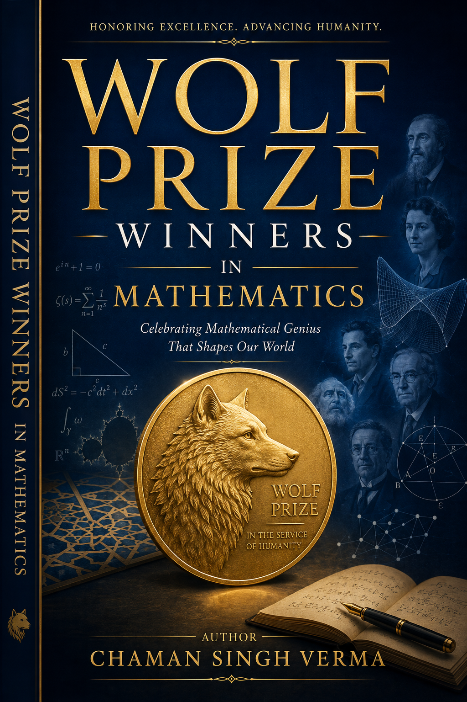

# Wolf Prize in Mathematics

<p align="center">
  
</p>

A comprehensive survey of every Wolf Prize in Mathematics laureate (1978–2024), covering biography, main contributions, and detailed mathematical exposition.

## Contents

68 chapters covering all Wolf Prize in Mathematics winners, including:

- **1978–2000**: Gelfand, Siegel, Leray, Weil, Cartan, Kolmogorov, Ahlfors, Zariski, Whitney, Krein, Chern, Erdős, Kodaira, Lewy, Eilenberg, Selberg, Itô, Lax, Hirzebruch, Hörmander, Calderón, Milnor, de Giorgi, Piatetski-Shapiro, Carleson, Thompson, Gromov, Tits, Moser, Langlands, Wiles, Keller, Sinai, Lovász, Stein, Bott, Serre, Arnold, Shelah, Sato, Tate, Margulis, Novikov, Smale, Furstenberg, Deligne
- **2008–2024**: Griffiths, Mumford, Sullivan, Yau, Aschbacher, Caffarelli, Mostow, Artin, Sarnak, Arthur, Schoen, Fefferman, Beilinson, Drinfeld, Le Gall, Lawler, Donaldson, Eliashberg, Lusztig, Daubechies, Alon, Shamir

Each chapter includes:
- Biography and career overview
- Main contributions with historical context
- Mathematical exposition with definitions, theorems, and proofs
- Impact on science and technology
- Frequently asked questions
- Glossary, exercises, and timeline

## Building

### Prerequisites

Install a LaTeX distribution (TeX Live, MiKTeX, or MacTeX) with these packages:
- `amsmath`, `amssymb`, `amsthm`, `amsfonts`, `mathtools`
- `physics`, `hyperref`, `geometry`, `fancyhdr`, `setspace`
- `enumerate`, `cite`, `wasysym`, `mathrsfs`

### Compile the full book

```bash
make
```

Or compile manually:

```bash
pdflatex -interaction=nonstopmode wolf_prize.tex
```

You may need to run `pdflatex` twice for cross-references.

### Clean build artifacts

```bash
make clean      # remove temporary files
make cleanall   # remove everything including PDF
```

## Project Structure

```
├── wolf_prize_main.tex      # Main document (includes all chapters)
├── chapters/                 # Chapter fragments
│   ├── chapter_01_gelfand.tex
│   ├── chapter_02_siegel.tex
│   └── ...                   # 68 chapters total
├── agentic/                  # AI research pipeline
│   └── agno_agents.py
├── Makefile                  # Build automation
└── README.md
```

## License

This project is for educational purposes. The Wolf Prize images and citations are property of the Wolf Foundation.
